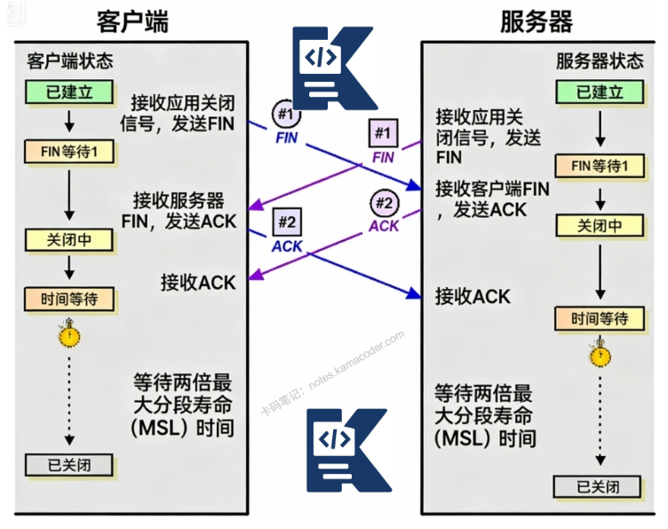

# TIME_WAIT状态的作用？

> 来源: https://notes.kamacoder.com/base/time-wait-state.html

# TIME_WAIT状态的作用？

## 简要回答

TIME_WAIT状态是TCP四次挥手后，**主动关闭方保持的2MSL**（最大报文段寿命的两倍）等待状态，**核心作用**：

  1.

**确保最后一个ACK可靠到达**：防止被动关闭方重传FIN

   2.

让旧连接的数据包在网络中消逝：**避免被新连接误接收**

   3.

**提供足够时间**让TCP实现清理资源：安全关闭连接

## 详细回答

TIME_WAIT状态详解：

  1. 触发时机

主动关闭方**在发送最后一个ACK后进入TIME_WAIT状态**

持续时间：2MSL（Maximum Segment Lifetime），**通常为60秒**（**Linux默认**）

位置：**TCP四次挥手的最后一步**

  1. 四次挥手过程与TIME_WAIT

```
主动关闭方 (Client)         被动关闭方 (Server)
      FIN ------------------->   (Client进入FIN_WAIT_1)
      &lt;------------------- ACK   (Server进入CLOSE_WAIT, Client进入FIN_WAIT_2)
      &lt;------------------- FIN   (Server进入LAST_ACK)
      ACK ------------------->   (Server进入CLOSED, Client进入TIME_WAIT)
      (等待2MSL)                 (Client进入CLOSED)

```


  1. TIME_WAIT的核心作用

作用一：**确保最后一个ACK可靠到达**

如果**最后一个ACK丢失，被动关闭方会重传FIN**

TIME_WAIT期间可以**接收这个重传的FIN并重发ACK**

避免被动关闭方**一直处于LAST_ACK状态**

作用二：**让旧连接的数据包从网络中消失**

网络中可能还有**旧连接的延迟数据包**

**2MSL时间确保这些数据包都超过最大寿命**

**防止**这些旧数据包被新建立的相同四元组连接**误接收**

作用三：**提供TCP实现清理时间**

确保**操作系统有足够时间清理连接资源**

**释放端口、内存等资源**

更新连接状态表

  1. 为什么是2MSL而不是1MSL？

1MSL：确保**最后一个ACK能到达被动关闭方**

另1MSL：**确保被动关闭方的重传FIN**（如果需要）**能到达**

总2MSL：**确保任何一方的重传报文都能被处理**

## 代码示例

```
class TCPTimeWaitDemo {
private:
    static constexpr int PORT = 8888;
    static constexpr int MSL = 30; // 简化的MSL，单位秒

public:
    void demonstrate_time_wait() {
        std::cout << "=== TCP TIME_WAIT 状态演示 ===" << std::endl;

        // 服务器线程
        std::thread server_thread([this]() {
            run_server();
        });

        // 等待服务器启动
        std::this_thread::sleep_for(std::chrono::milliseconds(100));

        // 客户端线程 - 主动关闭连接
        std::thread client_thread([this]() {
            run_client(true); // true表示主动关闭
        });

        client_thread.join();
        server_thread.join();

        std::cout << "\n=== 立即重用相同端口演示 ===" << std::endl;
        std::cout << "注意：这可能会失败，因为TIME_WAIT中" << std::endl;

        // 尝试立即重用端口
        try_reuse_port();
    }

private:
    void run_server() {
        int server_fd = socket(AF_INET, SOCK_STREAM, 0);
        if (server_fd < 0) {
            std::cerr << "服务器：创建socket失败" << std::endl;
            return;
        }

        // 设置SO_REUSEADDR
        int reuse = 1;
        if (setsockopt(server_fd, SOL_SOCKET, SO_REUSEADDR, &reuse, sizeof(reuse)) < 0) {
            std::cerr << "服务器：设置SO_REUSEADDR失败" << std::endl;
        }

        sockaddr_in addr{};
        addr.sin_family = AF_INET;
        addr.sin_port = htons(PORT);
        addr.sin_addr.s_addr = INADDR_ANY;

        if (bind(server_fd, (sockaddr*)&addr, sizeof(addr)) < 0) {
            std::cerr << "服务器：bind失败" << std::endl;
            close(server_fd);
            return;
        }

        if (listen(server_fd, 5) < 0) {
            std::cerr << "服务器：listen失败" << std::endl;
            close(server_fd);
            return;
        }

        std::cout << "服务器：监听端口 " << PORT << std::endl;

        sockaddr_in client_addr{};
        socklen_t client_len = sizeof(client_addr);
        int client_fd = accept(server_fd, (sockaddr*)&client_addr, &client_len);

        if (client_fd < 0) {
            std::cerr << "服务器：accept失败" << std::endl;
            close(server_fd);
            return;
        }

        std::cout << "服务器：客户端连接建立" << std::endl;

        // 接收数据
        char buffer[1024];
        ssize_t bytes = recv(client_fd, buffer, sizeof(buffer), 0);
        if (bytes > 0) {
            std::cout << "服务器：收到消息: " << std::string(buffer, bytes) << std::endl;
        }

        // 等待客户端关闭（被动关闭）
        std::cout << "服务器：等待客户端关闭连接..." << std::endl;

        // 接收FIN
        bytes = recv(client_fd, buffer, sizeof(buffer), 0);
        if (bytes == 0) {
            std::cout << "服务器：收到FIN，客户端关闭连接" << std::endl;
        }

        // 发送ACK
        std::cout << "服务器：发送ACK" << std::endl;

        // 发送自己的FIN
        std::cout << "服务器：发送FIN，进入LAST_ACK状态" << std::endl;

        // 等待客户端的ACK
        std::cout << "服务器：等待最后一个ACK..." << std::endl;
        std::this_thread::sleep_for(std::chrono::seconds(1));

        std::cout << "服务器：收到ACK，连接完全关闭" << std::endl;

        close(client_fd);
        close(server_fd);
    }

```


## 知识拓展

  1. TIME_WAIT相关参数优化

```
# Linux系统参数

net.ipv4.tcp_tw_reuse = 1      # 允许TIME_WAIT sockets重用

net.ipv4.tcp_tw_recycle = 0    # 不建议开启（已废弃）

net.ipv4.tcp_fin_timeout = 60  # FIN_WAIT_2超时时间

net.ipv4.tcp_max_tw_buckets = 262144  # TIME_WAIT最大数量

```


  1. 减少TIME_WAIT的影响

**使用SO_REUSEADDR**：允许重用TIME_WAIT状态的端口

**长连接代替短连接**：减少连接建立/关闭次数

**连接池**：复用连接而不是创建新连接

**调整TCP参数**：减少等待时间

  1. 不同操作系统的TIME_WAIT处理

Linux：默认60秒，可调整参数

Windows：默认240秒（4分钟）

BSD：默认60秒

Solaris：默认60秒

  - 使用场景

**高并发服务器**：Web服务器、API网关需要处理大量短连接

**负载均衡器**：大量后端连接的管理

**代理服务器**：频繁建立和关闭连接

**压力测试**：大量并发连接测试

**连接池设计**：需要了解连接生命周期

**网络故障排查**：分析连接关闭问题

  - 知识图解



  - 面试官很能追问

Q1：TIME_WAIT状态太多会有什么问题？

A1：
端口耗尽：无法创建新连接（最多约28000个临时端口）

内存占用：每个TIME_WAIT连接占用内核内存

性能下降：连接建立延迟增加

解决方案：

调整net.ipv4.tcp_max_tw_buckets,
启用net.ipv4.tcp_tw_reuse,
使用连接池,
增加可用端口范围

Q2：tcp_tw_reuse和tcp_tw_recycle的区别？

A2：
tcp_tw_reuse：允许将TIME_WAIT连接用于新的出向连接

条件：时间戳启用，且时间戳大于前一个连接
相对安全，推荐开启

tcp_tw_recycle：快速回收TIME_WAIT连接（已废弃）

基于时间戳的PAWS机制

在NAT环境下有问题，Linux 4.12+已移除
不建议使用

Q3：为什么客户端和服务端都有TIME_WAIT？
A3：
只有主动关闭方会进入TIME_WAIT状态

如果服务器主动关闭连接，服务器端会有TIME_WAIT

常见场景：
HTTP/1.0：服务器主动关闭（服务器有TIME_WAIT）

HTTP/1.1 Keep-Alive：客户端主动关闭（客户端有TIME_WAIT）

数据库连接：通常客户端主动关闭
