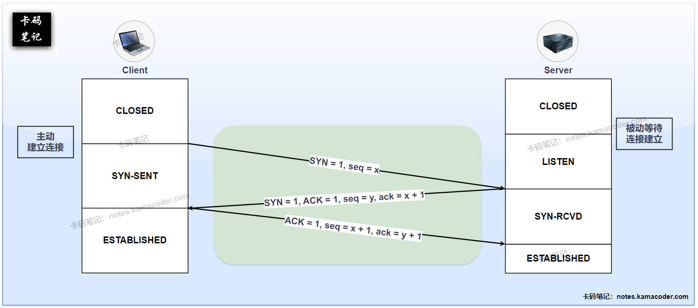

# 四次挥手的过程是怎样的？为什么是四次而不是三次或五次？

> 来源: https://notes.kamacoder.com/base/tcp-four-way-handshake.html

# 四次挥手的过程是怎样的？为什么是四次而不是三次或五次？

## 简要回答

  1. **TCP的四次挥手：**（假设客户端为主动关闭方，服务器是被动关闭方）

    - **第一次挥手：**

客户端向服务器发送`FIN = 1`的**连接释放报文段**（携带序列号`seq = u`），并进入 **FIN-WAIT-1** 状态。
     - **第二次挥手：**

服务器收到`FIN`报文后，发送一个`ACK = 1`的确认报文段（携带序列号`seq = v`，确认号`ack = u + 1`），并进入 **CLOSE-WAIT** 状态。此时客户端到服务器这个方向的连接被关闭。客户端收到`ACK`报文后进入 **FIN-WAIT-2** 状态。
     - **第三次挥手：**

服务器处理完剩余数据后，发送`FIN = 1，ACK = 1`的**连接释放报文段**（携带序列号`seq = w`，确认号`ack = u + 1`），之后服务器进入 **LAST-ACK** 状态。
     - **第四次挥手：**

客户端收到`FIN`报文后，向服务器发送一个`ACK = 1`的确认报文段（携带序列号 `seq = u + 1`，确认号 `ack = w + 1`），之后客户端进入 **TIME-WAIT** 状态，等待2MSL（最长报文寿命）后关闭。服务器收到`ACK`报文后进入 **CLOSED** 状态，关闭本次TCP连接。

   2. **为什么是四次挥手而不是三次或五次？**
    - **第四次挥手的必要性：**

若客户端直接关闭，最后一个`ACK`可能丢失，导致服务器一直处于 **LAST-ACK** 状态。。
     - **为什么不能是三次：**

因为服务器收到客户端的FIN（第一次挥手）后，通常不能立即发送自己的FIN，因为它可能还有数据要发送给客户端。所以服务器的ACK（第二次挥手）和FIN（第三次挥手）通常是分开的，无法合并。
     - **为什么不是五次：**

四次挥手已经完整地实现了双方连接的可靠关闭，每一步都有明确的目的，没有必要增加额外的步骤引入复杂性和开销。

## 详细回答

  1. **TCP的四次挥手：**（假设客户端为主动关闭方，服务器是被动关闭方）

    - **第一次挥手 (Client --> Server: FIN)**

Δ 客户端向服务器发送一个**连接释放报文段**，其中**终止位`FIN = 1`**，初始序号seq记为`u`。

Δ `FIN`报文即使不携带数据，也要消耗一个序列号。

Δ 客户端发送`FIN`报文后，进入 **FIN-WAIT-1** 状态，等待服务器的确认。此时客户端不能再发送数据，但仍然可以接收数据。
     - **第二次挥手 (Server --> Client: ACK)**

Δ 服务器收到客户端的`FIN`报文后，会发送一个确认报文段，其中**确认位`ACK = 1`**，序列号 seq 记为`v`，确认号 ack = `u + 1`。

Δ 服务器发送`ACK`报文后，进入 **CLOSE-WAIT** 状态。此时服务器通知其上层应用程序，对方已关闭发送通道。客户端收到这个该`ACK`报文后，进入 **FIN-WAIT-2** 状态，等待服务器发送关闭连接的`FIN-ACK`报文。
     - **第三次挥手 (Server --> Client: FIN-ACK)**

Δ 当服务器也没有数据要发送给客户端，并且其应用程序也决定关闭连接时，它会向客户端发送一个**连接释放报文段**，其中**终止位`FIN = 1`, 确认位`ACK = 1`**；假设此时服务器发送的序列号是 seq = `w`（如果服务器在第二次挥手后没有发送数据，w可能等于v；如果发送了数据，w会是基于v加上发送数据长度的值），确认号仍然是 ack = `u + 1`。

Δ 同第一次挥手类似，该`FIN`报文也需要消耗掉一个序号。

Δ 服务器发送`FIN`报文后，进入 **LAST-ACK** 状态，等待客户端的最终确认。
     - **第四次挥手 (Client --> Server: ACK)**

Δ 客户端收到服务器的`FIN-ACK`报文后，必须再向服务器发送一个确认报文段，其中**确认位`ACK = 1`** ，确认号 ack = `w + 1`，序列号 seq = `u + 1`。

Δ 客户端发送完确认报文段后，进入 **TIME-WAIT** 状态。服务器收到`ACK`报文后，连接正式关闭，进入 **CLOSED** 状态。客户端在 **TIME-WAIT** 状态下等待 2 MSL（Maximum Segment Lifetime，报文最大生存时间）后，才最终进入 **CLOSED** 状态。

Δ **TIME-WAIT** 状态的存在是为了**确保服务器能收到最后的`ACK`报文**，如果该报文丢失，服务器会超时重传它的`FIN-ACK`报文（第三次挥手）。客户端在 **TIME-WAIT** 状态可以响应这个重传的`FIN-ACK`，再次发送`ACK`，确保服务器能正常关闭。

   2. **为什么是四次挥手而不是三次或五次？**
    - **第四次挥手的必要性：**

第四次挥手是客户端对服务器FIN报文的确认（ACK），如果缺少这一步，服务器发送FIN后（进入 **LAST-ACK** 状态）将无法确认客户端是否收到了它的FIN。如果该FIN丢失，客户端将永远停留在 **FIN-WAIT-2** 状态；如果客户端收到了FIN但其ACK（第四次挥手）丢失，服务器将因收不到ACK而超时重传FIN。客户端必须能够处理这种情况并重发ACK。
     - **为什么不能是三次：**

① 当客户端发`FIN`后，服务器可能仍有数据要发送，需先回复`ACK`（第二次挥手），处理完数据再发`FIN`（第三次挥手）。若合并第二次和第三次挥手（直接发`FIN + ACK`），可能迫使服务器立即关闭，导致数据丢失。

② **RFC 793**规范了TCP是**全双工协议**，需独立关闭每个方向的数据流。
     - **为什么不是五次：**

客户端和服务器各发一次`FIN`和`ACK`，能明确关闭双向连接。五次挥手会增加冗余步骤（例如重复确认），但不会提升可靠性。

## 知识图解

  1. **TCP四次挥手的示意图如下**：
 

   2. **TCP三次握手的示意图如下**：
 

## 知识拓展

  1. **第三次挥手中ACK = 1的特殊性**：

    - **双重身份标识**：

① 第三次挥手是唯一一次同时具有**两种核心功能**的报文：它是服务端的主动关闭信号(FIN=1)。它同时也是对之前通信的确认(ACK=1)。

② 其他三次挥手要么是纯粹的关闭请求(第一次)，要么是纯粹的确认(第二次和第四次)。
     - **状态转换的关键点**：

① 第三次挥手的ACK标志使服务端完成了从CLOSE-WAIT到LAST-ACK的状态转换。这个转换有特殊意义：它标志着服务端从"被动响应关闭"转变为"主动请求关闭"。它是服务端在整个连接生命周期中最后一次发送数据的机会。
