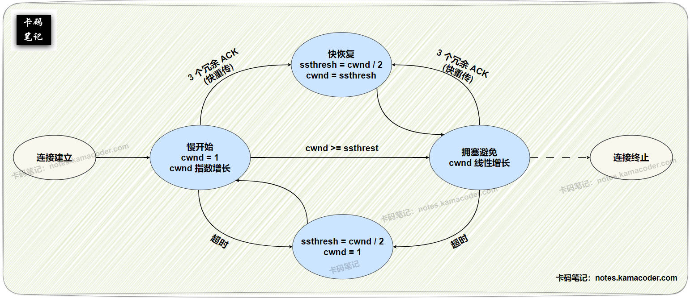
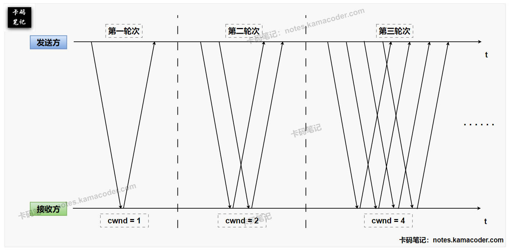

# 能说说拥塞控制是怎样实现的吗？

> 来源: https://notes.kamacoder.com/base/congestion-control.html

# 能说说拥塞控制是怎样实现的吗？

## 简要回答

### TCP 拥塞控制的定义与目的

  1. **定义：** TCP 拥塞控制是 TCP 协议中用于防止发送方往网络中注入过多数据，导致网络（如路由器）过载而性能下降（表现为丢包、高延迟）的一系列机制和算法。它通过**动态调整**发送方的发送速率来实现。
   2. **目的：** 主要目的是防止网络拥塞的发生或在发生后尽快缓解，从而保证网络的稳定性、公平性（多个 TCP 连接共享带宽）以及维持较高的传输效率。

### TCP 拥塞控制的四种经典算法

  1. **慢开始 (Slow Start - SS):** 连接建立初期 或 检测到超时丢包后，先发送少量数据，如果没有发生拥塞，则以**指数方式**快速增长发送速率（拥塞窗口 `cwnd`），目的是快速探测网络的可用带宽。
   2. **拥塞避免 (Congestion Avoidance - CA):** 当发送速率达到一定阈值后，转为较慢的**线性方式**增加发送速率，目的是在接近网络容量时更谨慎地探测，避免轻易导致拥塞。
   3. **快重传 (Fast Retransmit - FR):** 当发送方收到 **3 个或以上重复的确认 ACK** 时，不等超时就立即重传丢失的数据段，认为这很可能是单个丢包而非严重拥塞。
   4. **快恢复 (Fast Recovery - FR):** 在执行快重传后，不是将发送速率降回慢开始的初始状态，而是将其**减半**并进入拥塞避免状态，认为网络仍有一定承载能力，可以更快地恢复传输速率。

## 详细回答

### TCP 拥塞控制的定义与目的

  1. **定义：**
    - TCP 拥塞控制是 TCP 发送方用来调节自身向网络**发送数据速率**的一套**动态机制**。它独立于接收方的处理能力（那是流量控制的范畴），而是根据**对网络拥塞状况的感知**来调整发送行为。
     - TCP 拥塞控制的核心工具是维护一个称为**拥塞窗口 (Congestion Window, `cwnd`)** 的状态变量，该变量代表了发送方在收到确认前可以向网络发送的最大数据量（以**字节** 或 **报文段 MSS** 为单位）。发送方**实际可发送**的数据量受限于拥塞窗口 (`cwnd`) 和接收方通告的接收窗口 (`rwnd`) 的较小值，即 **`EffectiveWindow = min(cwnd, rwnd)`**。

   2. **目的：**
    - **防止拥塞崩溃：** 最根本的目的是防止过多的数据包同时涌入网络，超出中间路由器（瓶颈链路）的处理或转发能力，导致路由器队列溢出、大量丢包，进而引发大规模重传，使得网络有效吞吐量急剧下降，即所谓的“**拥塞崩溃**”。
     - **提高网络效率：** 在不导致拥塞的前提下，尽可能充分地利用网络可用带宽，实现较高的传输效率。
     - **保证相对公平性：** 理想情况下，**多个** 竞争同一瓶颈链路带宽的 **TCP 连接** 应该能够相对公平地共享带宽资源。拥塞控制算法的设计也需要考虑这一点。

### TCP 拥塞控制的四种经典算法 (基于 TCP Reno 版本)

  1. **慢开始 (Slow Start - SS):**
    - **启动条件：** 连接刚刚建立时；或者检测到超时 (RTO Timeout) 导致的丢包后。
     - **机制：**

① 初始 `cwnd` 通常设置为一个较小的值（如 1 到 10 个 MSS，RFC 5681 建议最多 10 MSS 且不超过约 16KB）。然后，**每收到一个对新发送数据段的 ACK**，`cwnd` 就增加 1 个 MSS (Maximum Segment Size)。这意味着在一个往返时间 (RTT) 内，如果所有发出的段都被确认，`cwnd` 会**翻倍**（指数增长）。

② 慢开始算法可以快速增加发送速率，以尽快达到网络的可用容量。当 `cwnd` 增长到**等于或超过**慢开始阈值 `ssthresh` 时，或者当检测到丢包时，慢开始阶段结束。如果是因为达到 `ssthresh`，则进入拥塞避免阶段。

   2. **拥塞避免 (Congestion Avoidance - CA):**
    - **启动条件：** 当 `cwnd` 达到 `ssthresh` 后，从慢开始算法切换过来。
     - **机制：**

① 拥塞避免算法不再进行指数增长，而是采用更保守的**线性增长**方式。**每经过一个 RTT**（即收到了对一个窗口内所有数据段的确认后），`cwnd` **增加 1 个 MSS**。

② 拥塞避免算法可以在接近估计的网络容量时，缓慢地探测更多可用带宽，避免因增长过快而导致拥塞。当检测到丢包事件（无论是超时还是收到 3 个重复 ACK）时，拥塞避免阶段结束。

   3. **快重传 (Fast Retransmit - FR):**
    - **启动条件：** 发送方连续收到了**三个或更多**的**重复 ACK** (Duplicate ACKs)。重复 ACK 指的是收到的 ACK 报文，其确认号与之前收到的某个 ACK 相同，通常意味着该确认号对应的那个数据段丢失了，而接收方收到了后续的数据段。
     - **机制：**

① 一旦收到 3 个重复 ACK，发送方就**不等重传计时器超时**，立即**重传**那个被认为丢失的数据段（即重复 ACK 请求的那个序号的数据段）。

   4. **快恢复 (Fast Recovery - FR):**
    - **启动条件：** 在执行了快重传之后。
     - **机制：**

① 快恢复算法认为收到 3 个重复 ACK 表明网络可能只是发生了少量丢包，而不是彻底拥塞，此时会将**慢开始阈值 `ssthresh` 设置为当前 `cwnd` 的一半**，将**拥塞窗口 `cwnd` 也减少到当前 `cwnd` 的一半**。

② 之后按照拥塞避免的线性增长规则增加 `cwnd`。（注意：原始的 Fast Recovery 算法在此处还有更复杂的 `cwnd` 临时调整，以处理重复 ACK 到达期间的窗口管理，但核心思想是避免回到 Slow Start）。

③ 在发生轻微丢包（由重复 ACK 触发）后，通过快恢复算法能够更快地恢复传输速率，避免将 `cwnd` 降至很小的值重新进行慢开始，从而在网络尚有容量时保持较高的吞吐量。

## 知识拓展

  1.

**TCP 拥塞控制 示意图如下**：
 

   2.

**慢开始算法示意图如下**：
 

 **Δ注意**，该示意图只是为了较为清晰地说明慢开始算法的原理，在实际的 TCP 拥塞控中，发送方**每收到一个确认报文段**，都会将自己的cwnd加1，并且都可以立即发送新的报文段，而不需要等待下一个轮次的到来。

   3.

**拥塞控制与流量控制的关系：**

    - **目标不同：** 拥塞控制是为了**防止发送方压垮整个网络**（路由器），关注的是发送方与网络之间的速率匹配；流量控制是为了**防止发送方压垮接收方**，关注的是发送方与接收方之间的速率匹配。
     - **控制变量不同：** 拥塞控制主要通过调整**拥塞窗口 (`cwnd`)** 来限制发送速率，`cwnd` 的大小由网络拥塞状况决定；流量控制主要通过接收方通告的**接收窗口 (`rwnd`)** 来限制发送速率，`rwnd` 的大小由接收方的可用缓冲区决定。
     - **协同工作：** 发送方在任何时刻实际能够发送的数据量（发送窗口）取决于这两者的**最小值**：`EffectiveWindow = min(cwnd, rwnd)`。这意味着，即使网络状况良好（`cwnd` 很大），如果接收方处理不过来（`rwnd` 很小），发送速率也会受到限制；反之，即使接收方有足够大的缓冲区（`rwnd` 很大），如果网络发生拥塞（`cwnd` 变小），发送速率也必须降下来。两者共同决定了 TCP 的发送行为。

   4.

**现代拥塞控制算法：**

    - 上述四种算法（慢开始、拥塞避免、快重传、快恢复）是 TCP 拥塞控制的基础（通常称为 **TCP Reno** 风格）。但随着网络环境的发展（如高带宽、高延迟、无线网络等），这些经典算法暴露出一些问题（如对丢包过于敏感、恢复速度慢等）。
     - 因此，出现了许多改进的拥塞控制算法，例如：

① **TCP NewReno:** 对快恢复阶段进行了改进，能更好地处理一个窗口内多个包丢失的情况。

② **TCP CUBIC:** 目前 Linux 系统默认使用的算法，对高带宽延迟（BDP）网络环境做了优化，窗口增长函数基于三次方程，更稳定且能更快地利用高带宽。

③ **TCP BBR (Bottleneck Bandwidth and Round-trip propagation time):** 由 Google 开发，尝试不再依赖丢包作为主要的拥塞信号，而是直接估计网络的瓶颈带宽和往返传播时间来决定发送速率，旨在在高丢包率或浅缓冲区网络中获得更好的性能。
