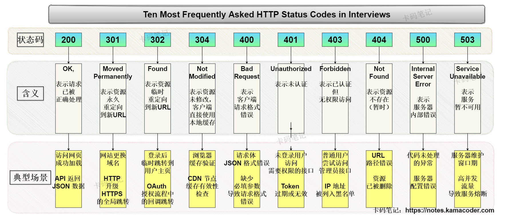

# HTTP中常见的状态码有哪些？分别是什么含义？

> 来源: https://notes.kamacoder.com/base/http-status-codes.html

# HTTP中常见的状态码有哪些？分别是什么含义？

## 简要回答

  - **面试最高频的十个HTTP状态码**，如下：

    1. **200**：**OK**，表示请求已被**正确**处理（如网页加载成功、API 成功返回数据）。
     2. **301**：**Moved Permanently**，表示资源**永久**重定向到新 URL（如网站更换域名，旧链接跳转）。
     3. **302**：**Found**，表示资源**临时**重定向到新 URL（如登录后跳转回原页面）。
     4. **304**：**Not Modified**，表示资源**未修改**，客户端直接使用本地缓存（缓存机制的核心状态码）。
     5. **400**：**Bad Request**，表示客户端**请求**格式**错误**（如参数缺失、JSON 语法错误）。
     6. **401**：**Unauthorized**，表示**未认证**（如未登录时访问需权限的接口）。
     7. **403**：**Forbidden**，表示**无权限**访问资源（如普通用户访问管理员接口）。
     8. **404**：**Not Found**，表示资源**不存在**（如 URL 路径错误、文件被删除）。
     9. **500**：**Internal Server Error**，表示**服务器内部错误**（如代码异常、数据库崩溃）。
     10. **503**：**Service Unavailable**，表示**服务暂时不可用**（如服务器维护、过载熔断）。

## 详细回答

### 一、2xx（成功类）

  1. **200**：

    - **定义**：**OK**，表示请求已被服务器**正确**处理；**GET**请求一般返回资源内容，而**POST**请求则可能返回操作结果或新资源链接。
     - **典型场景**：访问网页成功加载（HTML 内容）；API 返回 JSON 数据。

### 二、3xx（重定向类）

  1. **301**：

    - **定义**：**Moved Permanently**，表示请求的资源已**永久重定向**到新 URL，客户端应更新书签或链接；浏览器会**缓存此重定向**，后续请求直接访问新 URL。
     - **典型场景**：网站更换域名（如 `programmercarl.com` → `notes.kamacoder.com`）；HTTP 升级 HTTPS 的全局跳转。

   2. **302**：

    - **定义**：**Found**，表示资源**临时重定向**到新 URL，客户端后续请求可能仍访问原 URL；浏览器默认对 `302` 使用 **GET** 方法重定向，即使原请求是 **POST**。
     - **典型场景**：登录后临时跳转到用户主页；OAuth 授权流程中的回调跳转。

   3. **304**：

    - **定义**：**Not Modified**，表示资源**未修改**，客户端可直接使用缓存副本；服务器不返回响应体，仅返回 `304` 状态和缓存相关头部。
     - **典型场景**：浏览器缓存验证（通过 `If-Modified-Since` 请求头）；CDN 节点缓存有效性检查。

### 三、4xx（客户端错误类）

  1. **400**：

    - **定义**：**Bad Request**，客户端请求存在**语法或参数错误**，服务器无法处理；需结合响应体中的错误描述排查问题。
     - **典型场景**：请求体 JSON 格式错误；缺少必填参数导致请求格式错误。

   2. **401** ：

    - **定义**：**Unauthorized**，请求**未提供有效身份凭证**，需认证后重试。
     - **典型场景**：未登录用户访问需要权限的接口；Token 过期或无效。

   3. **403**：

    - **定义**：**Forbidden**，客户端身份已认证，但**无权访问**目标资源；隐藏无权限资源时可能返回 `404` 替代。
     - **典型场景**：普通用户尝试访问管理员接口；IP 地址被列入黑名单。

   4. **404**：

    - **定义**：**Not Found**，服务器**未找到**请求的资源；有可能是服务器故意隐藏资源存在性（如避免敏感信息泄露）。
     - **典型场景**：URL 路径错误；资源已被删除（如用户访问已下架商品）。

### 四、5xx（服务器错误类）

  1. **500**：

    - **定义**：**Internal Server Error**，**服务器内部错误**，无法完成请求；开发环境下应返回详细错误堆栈，生产环境需隐藏敏感信息。
     - **典型场景**：代码未处理的异常（如空指针、数据库连接失败）；服务器配置错误。

   2. **503**：

    - **定义**：**Service Unavailable**，服务器**暂时**无法处理请求（通常因过载或维护）。
     - **典型场景**：服务器维护窗口期；高并发流量导致服务熔断（如秒杀活动）。

## 知识拓展

  -

**高频HTTP状态码详解**，如下图所示：
 

   -

**更多HTTP状态码**，如下表所示：

| **状态码**  **状态码英文名称**  **中文描述**
| `100`  **Continue**  继续。客户端应继续其请求
| `101`  **Switching Protocols**  切换协议。服务器根据客户端的请求切换协议（如升级到 WebSocket）
| `200`  **OK**  请求成功。一般用于 GET 与 POST 请求
| `201`  **Created**  已创建。成功请求并创建了新的资源
| `202`  **Accepted**  已接受。已接受请求但未处理完成（常用于异步任务）
| `203`  **Non-Authoritative Information**  非授权信息。返回的元信息来自副本而非原始服务器
| `204`  **No Content**  无内容。服务器成功处理但未返回内容（如 DELETE 请求）
| `205`  **Reset Content**  重置内容。客户端应重置文档视图（如清空表单）
| `206`  **Partial Content**  部分内容。服务器成功处理了部分 GET 请求（如断点续传）
| `300`  **Multiple Choices**  多种选择。资源有多个地址可选，需客户端选择
| `301`  **Moved Permanently**  永久移动。资源已永久重定向到新 URI（浏览器会缓存新地址）
| `302`  **Found**  临时移动。资源临时重定向到新 URI（后续请求仍用原地址）
| `303`  **See Other**  查看其他地址。强制客户端用 GET 方法访问新 URI（常用于 POST 后重定向）
| `304`  **Not Modified**  未修改。客户端缓存资源有效，无需重新传输
| `305`  **Use Proxy**  使用代理。请求必须通过代理访问（现代浏览器已弃用）
| `306`  **Unused**  已废弃（原设计用于后续请求的代理，现被 307/308 替代）
| `307`  **Temporary Redirect**  临时重定向。保持原请求方法重定向（如 POST 请求临时重定向）
| `400`  **Bad Request**  客户端请求语法错误，服务器无法理解
| `401`  **Unauthorized**  未认证。需提供有效身份凭证（如登录 Token）
| `402`  **Payment Required**  保留状态（实际用于支付场景，如 Stripe API 调用）
| `403`  **Forbidden**  禁止加粗访问。已认证但无权限访问资源
| `404`  **Not Found**  未找到。服务器无法根据请求找到资源
| `405`  **Method Not Allowed**  方法禁用。请求的 HTTP 方法不被允许（如用 GET 访问仅支持 POST 的接口）
| `406`  **Not Acceptable**  不可接受。服务器无法提供客户端要求的媒体类型（如只支持 JSON 但请求 XML）
| `407`  **Proxy Authentication Required**  代理认证要求。需通过代理服务器认证
| `408`  **Request Time-out**  请求超时。服务器等待客户端发送请求时间过长
| `409`  **Conflict**  冲突。请求与服务器当前状态冲突（如并发编辑资源版本冲突）
| `410`  **Gone**  已删除。资源永久不存在（与 404 不同，明确表示资源被主动删除）
| `411`  **Length Required**  需要有效长度。请求必须包含 `Content-Length` 头部
| `412`  **Precondition Failed**  前提条件失败。请求头中的条件不满足（如 `If-Match` 校验失败）
| `413`  **Request Entity Too Large**  请求实体过大。服务器拒绝处理（如上传文件超过限制）
| `414`  **Request-URI Too Large**  URI 过长。请求的 URL 超过服务器限制（如 GET 参数过长）
| `415`  **Unsupported Media Type**  不支持的媒体类型。服务器无法处理请求附带的格式（如上传文件类型不被支持）
| `416`  **Requested range not satisfiable**  请求范围无效。客户端要求超出资源的可用范围（如请求文件末尾之外的数据）
| `417`  **Expectation Failed**  预期失败。服务器无法满足 `Expect` 请求头的要求（如 `Expect: 100-continue` 不被支持）
| `500`  **Inte**加粗**rnal Server Error**  服务器内部错误。代码异常或配置错误
| `501`  **Not Implemented**  未实现。服务器不支持请求的功能（如使用未启用的 HTTP 方法）
| `502`  **Bad Gateway**  网关错误。代理服务器从上游收到无效响应（如后端服务崩溃）
| `503`  **Service Unavailable**  服务不可用。服务器过载或维护中（可通过 `Retry-After` 头指定重试时间）
| `504`  **Gateway Time-out**  网关超时。代理服务器未及时从上游获取响应（如后端服务响应超时）
| `505`  **HTTP Version not supported**  不支持的 HTTP 版本。服务器不支持请求中的协议版本（如请求 HTTP/3 但服务器仅支持 HTTP/1.1）
