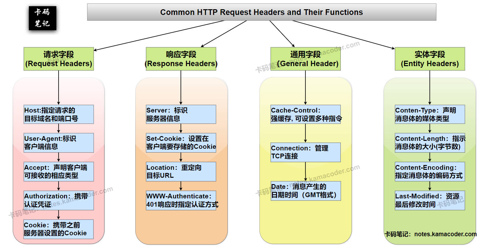

# HTTP请求中的头部字段有哪些常见的类型？它们各自的作用是什么？

> 来源: https://notes.kamacoder.com/base/http-headers.html

# HTTP请求中的头部字段有哪些常见的类型？它们各自的作用是什么？

## 简要回答

  1. **请求字段（Request Headers）**：

    - `Host`：指定请求的**目标域名和端口号**。
     - `User-Agent`：标识**客户端信息**（浏览器/设备类型）。
     - `Accept`：声明客户端**可接受的响应类型**。
     - `Authorization`：携带**认证凭证**（如Bearer Token）。

   2. **响应字段（Response Headers）**：

    - `Server`：标识**服务器软件信息**。
     - `Set-Cookie`：设置**在客户端要存储的Cookie**。
     - `Location`：重定向目标**URL**（3xx响应时）。

   3. **通用字段（General Headers）**：

    - `Cache-Control`：控制**缓存**行为（**强缓存**）。
     - `Connection`：管理**TCP连接**（如keep-alive）。

   4. **实体字段（Entity Headers）**：

    - `Content-Type`：声明消息体的**媒体类型**。
     - `Content-Length`：指示消息体的**大小**（**字节数**）。
     - `Content-Encoding`：指定消息体的**编码方式**。

## 详细回答

  1. **请求字段（Request Headers）**：

    - `Host`：指定请求的**目标域名和端口号**，**HTTP/1.1必需**字段，解决虚拟主机问题（一个IP多个域名）。
     - `User-Agent`：标识**客户端信息**（浏览器/设备类型），不仅包含**浏览器类型**（如Chrome/Firefox），还包括**操作系统信息**。服务器可据此返回移动端或PC端适配页面。
     - `Accept`：声明客户端**可接受的响应类型**，通过**MIME类型**协商内容，如`Accept: application/json`表示客户端希望获取JSON格式数据。
     - `Authorization`：携带**认证凭证**（如Bearer Token），常见于OAuth2.0认证（Bearer token格式）。
     - `Cookie`：携带之前服务器设置的Cookie信息。

   2. **响应字段（Response Headers）**：

    - `Server`：标识**服务器信息**，生产环境常被隐藏以避免服务器信息泄露。
     - `Set-Cookie`：设置**在客户端要存储的Cookie**，可设置多个属性控制Cookie行为，如 `HttpOnly` 防止JS读取，`Secure` 要求HTTPS传输。
     - `Location`：重定向目标**URL**，与302状态码配合使用时，浏览器会自动跳转到指定URL，常用于短链接服务。
     - `WWW-Authenticate`：401响应时指定**认证方式**（如Basic realm）。

   3. **通用字段（General Headers）**：

    - `Cache-Control`：控制**缓存**行为（**强缓存**）。，可设置多种指令，如`max-age=3600`表示缓存有效期1小时，`no-store`要求不缓存。
     - `Connection`：管理**TCP连接**（如keep-alive），HTTP/1.1默认`keep-alive`保持TCP连接复用，显著减少重复握手开销。
     - `Date`：消息产生的日期时间（GMT格式）。

   4. **实体字段（Entity Headers）**：

    - `Content-Type`：声明消息体的**媒体类型**，常见值包括text/html、application/json等。
     - `Content-Length`：指示消息体的**大小**（**字节数**），帮助客户端判断响应是否接收完整，对于动态生成的内容，服务器可能使用分块传输编码（Transfer-Encoding: chunked）替代。
     - `Content-Encoding`：指定消息体的**编码方式**，支持gzip/deflate等压缩算法。
     - `Last-Modified`：资源最后修改时间（用于缓存验证）。

## 知识拓展

  1.

**HTTP常见字段分类总结**，如下图所示：
 

   2.

**请求字段、响应字段、通用字段和实体字段直接的关系**：

    - **功能边界**：

① **请求字段**：专门描述客户端发起的请求特性（如`User-Agent`说明客户端环境）

② **响应字段**：专门描述服务端返回的响应特性（如`Server`说明服务端环境）

③ **通用字段**：描述消息传输的通用控制（如`Cache-Control`同时影响请求和响应的缓存逻辑）

④ **实体字段**：专门描述消息体（body）的元信息（如`Content-Type`说明body的格式）
     - **为什么实体字段不归为通用字段**：
虽然实体字段可同时出现在请求和响应中，但其功能范畴严格限定于描述消息体（body）的属性。而通用字段控制的是消息传输层面的行为（如连接管理、缓存控制），二者在协议设计层面就被明确区分。例如：

① `Content-Type`（实体字段）只关心body是什么格式

② `Connection`（通用字段）关心的是TCP连接是否保持 这种职责分离使得协议更易于理解和实现。
