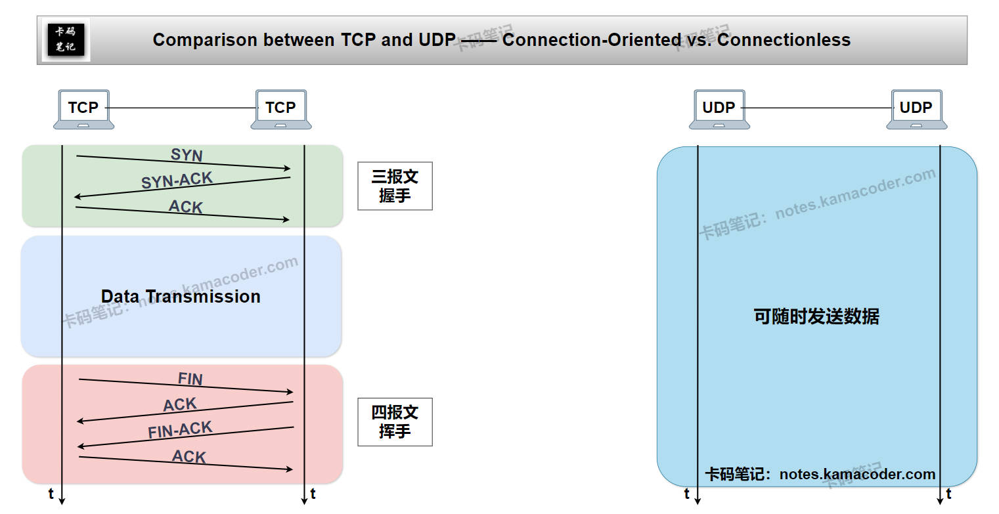
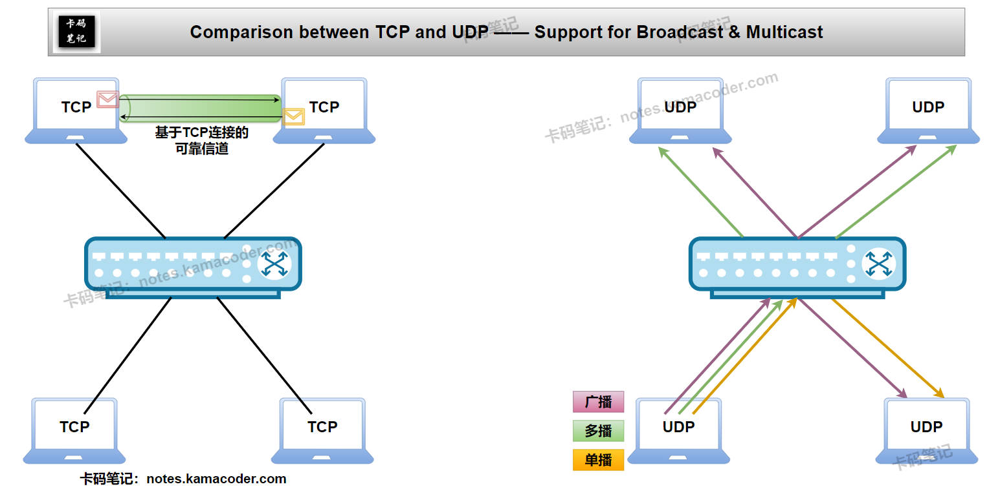
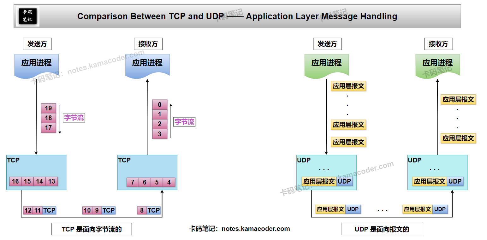

# TCP和UDP的区别是什么？

> 来源: https://notes.kamacoder.com/base/tcp-vs-udp.html

# TCP和UDP的区别是什么？

## 简要回答

  1. **TCP 和 UDP的概念**：

    - **TCP**（传输控制协议）：**面向连接**的**可靠**传输协议，保证数据完整有序到达。
     - **UDP**（用户数据报协议）：**无连接**的**不可靠**传输协议，注重传输速度和简单性。

   2. **TCP 和 UDP的区别**：

    -

如下表所示：

| **对比维度**  **TCP**  **UDP**
| **连接方式**  面向连接（三次握手）  无连接
| **可靠性**  可靠（确认、重传、校验）  不可靠（可能丢包、乱序）
| **传输顺序**  数据按序到达  不保证顺序
| **传输速度**  较慢（建立连接、重传开销）  极快（无额外控制）
| **头部开销**  20字节（较大）  8字节（极小）
| **流量控制**  支持（滑动窗口）  不支持
| **拥塞控制**  支持（慢启动、拥塞避免）  不支持
| **应用场景**  网页、邮件、文件传输  视频流、游戏、DNS查询

## 详细回答

  1. **TCP和UDP的概念**：

    - **TCP**：通过三次握手**建立连接**，提供**端到端的可靠传输**，确保数据无差错、不丢失、按序到达。
     - **UDP**：直接发送数据包，**不建立连接**，**不保证传输质量**，但延迟极低，适用于**实时性要求高**的场景。

   2. **TCP和UDP的区别**：

    - **连接方式**：
 **TCP**：TCP需先通过**三次握手建立连接**（SYN、SYN-ACK、ACK），数据传输完成后，再通过**四次挥手释放连接**（FIN、ACK、FIN-ACK、ACK）。
 **UDP**：UDP直接发送数据包，**无需握手和挥手**。
     - **可靠性**：
 **TCP**：TCP通过确认应答（ACK）、超时重传、数据校验（校验和）**确保数据可靠**。
 **UDP**：UDP无重传机制，发送即丢弃，**可靠性由应用层处理**（如视频丢帧不影响整体）。
     - **传输顺序**：
 **TCP**：TCP通过序列号（Sequence Number）保证接收端**按序**重组数据。
 **UDP**：UDP不维护数据顺序，接收端**可能乱序接收**（如VoIP通话中语音包顺序错乱）。
     - **传输速度**：
 **TCP**：TCP因连接管理、流量控制、重传等机制，**传输延迟较高**。
 **UDP**：UDP无控制开销，**传输速度极快**，适合实时应用（如在线游戏、直播）。
     - **头部开销**：
 **TCP**：TCP**头部最小20字节**（含选项字段可扩展），包含序列号、确认号、窗口大小等字段。
 **UDP**：UDP**头部固定8字节**（仅源/目标端口、长度、校验和）。
     - **流量控制**：
 **TCP**：TCP通过**滑动窗口**动态调整发送速率，避免接收方缓冲区溢出。
 **UDP**：UDP**无流量控制**，可能因接收方处理不及时导致丢包。
     - **拥塞控制**：
 **TCP**：TCP通过**慢启动、拥塞避免、快重传**等算法避免网络拥堵。
 **UDP**：UDP**无拥塞控制**，可能加剧拥塞（如P2P下载中的UDP Flood攻击）。
     - **应用场景**：
 **TCP**：HTTP/HTTPS、SMTP（邮件）、FTP（文件传输）。
 **UDP**：DNS查询、视频会议（Zoom）、在线游戏（UDP+应用层可靠性增强）。

## 知识拓展

  1.

**TCP 和 UDP 的连接机制对比**，如下图所示：
 

   2.

**TCP 和 UDP 通信机制对比**，如下图所示：
 

   3.

**TCP 和 UDP 应用层报文处理对比**，如下图所示：
 
