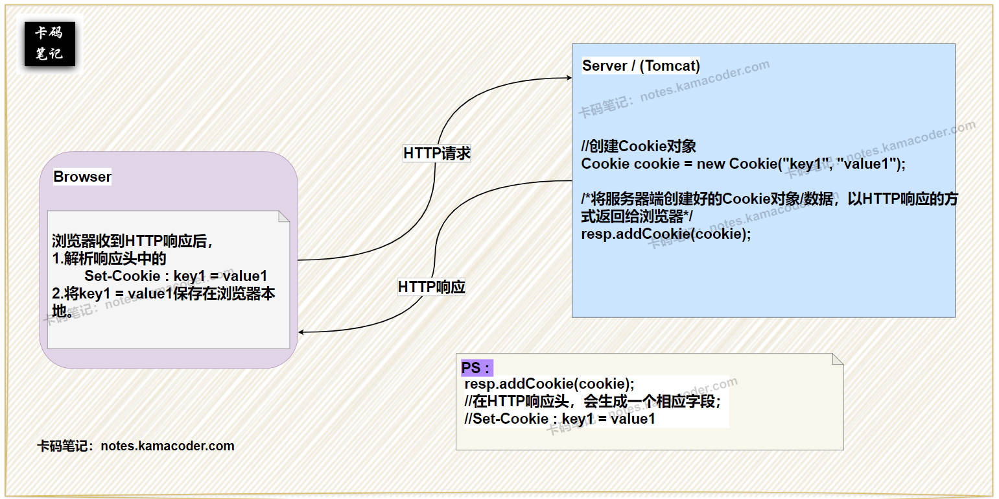
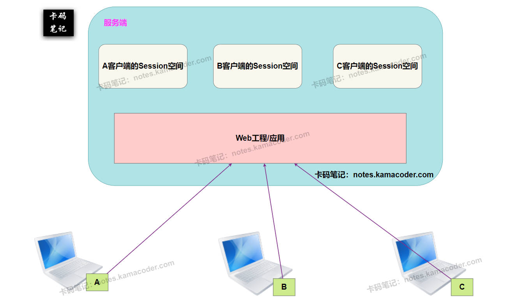
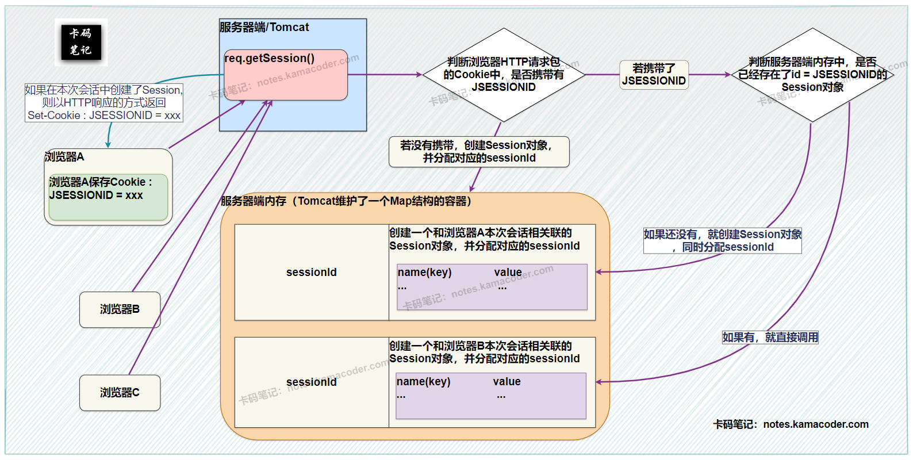

# Cookie和Session的区别？

> 来源: https://notes.kamacoder.com/base/cookie-vs-session.html

# Cookie和Session的区别？

## 简要回答

### Cookie 和 Session 的概念

  1. **Cookie**：

    - **定义**：Cookie 是服务器发送到浏览器并**存储在本地**的一小段数据（键值对），用于跟踪用户状态。**Cookie** 是浏览器端的存储和传递**载体**（存Session ID或简单数据）。
     - **作用**：解决 **HTTP 无状态问题**，存储用户偏好或会话标识（如 Session ID）。
     - **工作原理**：服务器通过 **`Set-Cookie`** **响应头**下发数据，浏览器后续请求自动通过 **`Cookie`** **请求头**回传。

   2. **Session**：

    - **定义**：Session 是服务器端维护的会话状态，通过唯一 ID 关联用户请求。
     - **作用**：存储敏感或临时数据（如用户登录状态），依赖 Session ID 与浏览器交互。
     - **工作原理**：服务器生成 Session ID 并通过 Cookie（如 `JSESSIONID`）下发，浏览器携带该 ID 以找回对应 Session 数据。

### Cookie 和 Session 的区别

  -

如下表所示：

| **维度**  **Cookie**  **Session**
| **存储位置**  浏览器端  服务器端
| **安全性**  较低（用户可篡改）  较高（服务端控制）
| **数据类型**  仅字符串  支持复杂对象（如 Java Object）
| **生命周期**  可长期有效（手动设置）  通常随会话结束失效
| **性能影响**  增加请求头大小  占用服务器资源

## 详细回答

### Cookie 和 Session 的概念

  1. **Cookie**：

    - **定义**：

① Cookie 是 HTTP 协议扩展机制（RFC 6265），是由服务器通过 **`Set-Cookie`** 头部发送的文本数据（如 `username=kamanotes`），通常用于保存服务器**在客户端保存**的用户相关信息，比如登录名，浏览记录等非敏感信息， 就可以通过cookie方式来保存。

② **Cookie** 是浏览器端的存储和传递**载体**（存Session ID或简单数据）。Cookie所存储的信息数据量并不大，**服务器端在需要的时候可以从客户端/浏览器读取(遵循HTTP协议；req.getCookies()方法)。浏览器向服务器发送HTTP请求时，会在请求包中自动携带当前服务器域名下对应的Cookie**。
     - **作用**：实现轻量级状态管理（如记住登录态、语言偏好），或传递 Session ID 以关联服务端 Session。
     - **工作原理**：

① 服务器响应：`Set-Cookie: username=kamanotes; Path=/; HttpOnly`

② 浏览器请求：`Cookie: username=kamanotes`

   2. **Session**：

    - **定义**：

① Session 是服务器创建的会话上下文，通过唯一 ID（如 `JSESSIONID`）标识，数据存储**在服务端内存或数据库**。

② 由于session对象为各个用户浏览器所独享，所以**各个用户在访问服务器的不同页面时，可以从各自的session中读取/添加数据**，实现自己操纵自己相关的数据。

③ Session可以用于保存网络商场中的购物车信息，网站登录用户的信息等，也可以防止用户非法登录到某个页面。
     - **作用**：管理敏感信息（如用户权限、购物车数据），避免直接暴露给客户端。
     - **工作原理**：

① 服务器生成 Session ID 并下发至浏览器（通常通过 Cookie 保存该SessionID）。

② 浏览器携带该 ID，服务器据此找回对应 Session 数据。

### Cookie 和 Session 的区别

  1. **存储位置**：

    - **Cookie**：数据存储在**浏览器端**，用户可见可修改（需防范篡改）。
     - **Session**：数据存储在**服务器端**（如 Redis），仅通过 Session ID 关联浏览器，安全性更高。

   2. **安全性**：

    - **Cookie**：

① 风险：安全性较低，可能被 XSS 攻击窃取（需 `HttpOnly`）、CSRF 攻击利用（需 `SameSite`）。

② 适用场景：存储非敏感数据（如主题偏好）。
     - **Session**：

① 风险：安全性较高，但仍需防范 Session 固定攻击（生成新 Session ID 后需销毁旧 ID）。

② 优势：敏感数据（如用户ID）始终在服务端，仅传递 Session ID。

   3. **数据类型**：

    - **Cookie**：**值必须是字符串**（HTTP 头部文本协议限制），存储对象需手动序列化（如 JSON）。
     - **Session**：**值可为任意对象**（如 Java 的 `Object`、PHP 的数组），由服务端框架自动处理序列化。

   4. **生命周期**：

    - **Cookie**：

① 默认会话级（浏览器关闭失效），可通过 `Expires`/`Max-Age` 设为持久化。
② 示例：`Set-Cookie: username=kamanotes; Max-Age=2592000`（30 天有效）。
     - **Session**：

① 默认依赖 Session ID 的 Cookie 生命周期（通常会话级），服务端可主动设置超时（如 Tomcat 的 `session-timeout`）。

   5. **性能影响**：

    - **Cookie**：每次请求自动携带，可能增加带宽消耗（尤其多个 Cookie 时）。
     - **Session**：占用服务器内存或数据库资源，高并发时需优化存储（如 Redis 集群）。

## 知识拓展

  1.

**Cookie的基本原理**，如下图所示：
 

   2.

**Session的基本原理**，如下图所示：
 

   3.

**HttpServletRequest类的getSession方法**，底层机制如下图所示：
 

   4.

**Cookie 和 Session 的协作关系**：

    - **典型场景**：

服务器创建 Session 后，通过 `Set-Cookie: JSESSIONID=abc123carl` 下发 Session ID，浏览器后续请求携带该 Cookie 以维持会话。
     - **无 Cookie 方案**：

① URL 重写：将 Session ID 嵌入 URL（如 `/path;jsessionid=abc123`），但安全性差。

② Token 替代：JWT 直接将 Session 数据编码到 Token 中，无需服务端存储。

   5.

**现代架构中的演进**：

    - **分布式 Session**：

① 问题：多服务器时 Session 如何共享？

② 方案：集中存储（如 Redis）+ Session ID 一致性哈希。
     - **无状态设计**：

① 趋势：RESTful API 使用 JWT，完全摒弃服务端 Session。
