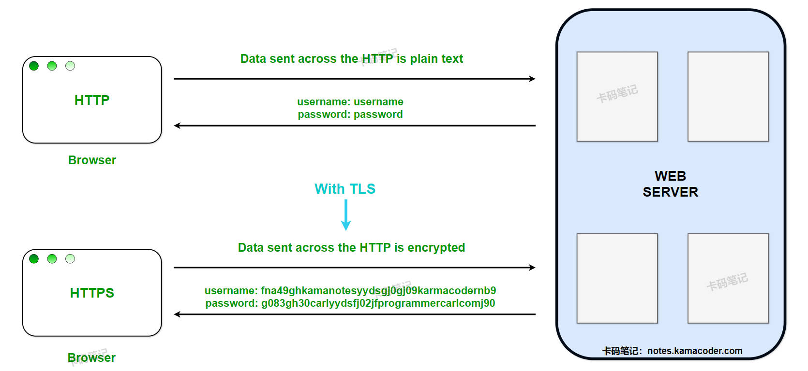

# HTTPS和HTTP有哪些区别？

> 来源: https://notes.kamacoder.com/base/https-vs-http.html

# HTTPS和HTTP有哪些区别？

## 简要回答

### HTTP 和 HTTPS 的概念

  1. **HTTP**（HyperText Transfer Protocol）：一种明文传输的超文本传输协议，用于客户端与服务器之间的通信。
   2. **HTTPS**（HyperText Transfer Protocol Secure）：基于 HTTP 的加密版本，通过 SSL/TLS 协议实现数据加密和身份认证。

### HTTP 和 HTTPS 的区别

  -

如下表所示：

| **对比维度**  **HTTP**  **HTTPS**
| **加密与安全性**  明文传输，无加密  使用 SSL/TLS 加密，确保数据机密性和完整性
| **协议与端口**  默认端口 **80**  默认端口 **443**
| **证书与身份验证**  无证书要求  需 CA 签发数字证书，验证服务器身份
| **协议版本与 HTTPS 强制性**  HTTP/1.1、HTTP/2 可明文传输  HTTP/3 强制使用 HTTPS；HTTP/2 默认需 HTTPS
| **浏览器行为与 SEO**  标记为“不安全”  显示“安全”标识，提升 SEO 排名

## 详细回答

### HTTP 和 HTTPS 的概念

  1. **HTTP（HyperText Transfer Protocol）**：

超文本传输协议（HTTP）是互联网上应用最广泛的协议，用于客户端（如浏览器）与服务器之间的数据传输。它基于请求-响应模型，但所有数据（包括请求头、Cookie、表单内容等）均以**明文传输**，易被窃听和篡改。
   2. **HTTPS（HyperText Transfer Protocol Secure）**：

安全超文本传输协议（HTTPS）是 HTTP 的安全版本，通过 SSL/TLS 协议对通信内容**加密**，并**验证服务器身份**。它保护数据在传输过程中不被窃取或篡改。

### HTTP 和 HTTPS 的区别

  1. **加密与安全性**：

    - **HTTP**：

所有数据（包括敏感信息如密码、信用卡号）均以**明文传输**，攻击者可轻易通过中间人攻击（Man-in-the-Middle）截获或篡改数据。
     - **HTTPS**：

① **加密传输**：使用 TLS 协议对数据加密（如 AES、ChaCha20 算法），确保传输内容不可读。

② **数据完整性**：通过哈希算法（如 SHA-256）验证数据未被篡改。

③ **身份认证**：服务器需提供由可信 CA（如 Let’s Encrypt）签发的数字证书，防止钓鱼网站。

   2. **协议与端口**：

    - **HTTP**：

使用 TCP 协议，默认端口 `80`。
     - **HTTPS**：

① 在 HTTP 与 TCP 之间加入 SSL/TLS 层，默认端口 `443`。

② **TLS 握手**：建立连接时需进行 TLS 握手（1-RTT 或 0-RTT），增加约 1-2 个网络往返延迟（RTT），但 HTTP/2 和 HTTP/3 已优化此开销。

   3. **证书与身份验证**：

    - **HTTP**：

无证书要求，客户端无法验证服务器身份。
     - **HTTPS**：

① **证书要求**：服务器需部署 CA 签发的证书（如 DV、OV、EV 证书），证明其域名所有权和合法性。

② **证书链验证**：客户端（浏览器）会验证证书链是否由可信 CA 签发，并检查证书是否过期或被吊销。

   4. **协议版本与 HTTPS 强制性**：

    - **HTTP/1.1 和 HTTP/2**：

协议本身支持明文传输（HTTP），但主流浏览器（如 Chrome、Firefox）强制要求 HTTP/2 必须运行在 HTTPS 上。
     - **HTTP/3**：

基于 QUIC 协议设计，强制集成 TLS 1.3，**必须使用 HTTPS**。

   5. **浏览器行为与 SEO**：

    - **HTTP**：

① 浏览器标记为“不安全”（如地址栏显示红色警告图标）。

② 混合内容（HTTPS 页面加载 HTTP 资源）会被拦截（如脚本、图片）。
     - **HTTPS**：

① 显示“安全”标识（如锁形图标），提升用户信任。

② **SEO 优化**：Google 等搜索引擎优先排名 HTTPS 网站。

## 知识拓展

  1. HTTP 和 HTTPS 的区别，如下图所示：
 

   2. **How Does the HTTP Protocol Work?**
    - This means that the HTTP protocol uses a request-response operational model. When a client wants to retrieve information, it uses http request to the servers as shown in the following stages. The request is received by the server and in the form of an HTTP response the server returns the data which the client requested or an error message. This takes place over the internet using port 80 by default, to assist in the identification of this protocol it is often referred to as the http or the hip protocol.

   3. **How Does the HTTPS Protocol Work?**
    - HTTPS can be said to be similar to the HTTP only that it also provides a level of security. It first creates a connection between the client and server over SSL/TLS, which enhances security by encrypting the Client and server communication. When a client makes a request for a resource using the https then the server and the client agree on the encryption keys that will be used in encrypting the data that will be transmitted in that particular session. This makes sure that data being exchanged between them is encrypted and coded hence cannot be intercepted.

   4. **How Does HTTPS Help Authenticate Web Servers?**
    - HTTPS assists in qualifying web servers by means of digital certificates provided by Certificate Authorities. When a client established an TLS connection to a particular server using HTTPS the server sends the certificate to the client as the proof of its identity. In this case, client will validate this certificate with the list of trusted CAs to confirm that the server is authentic. This process broke man-in-the-middle attack and guarantees that end users are accessing the correct server.
