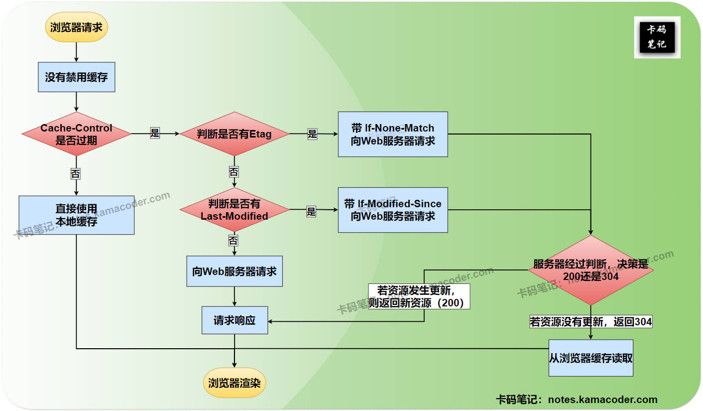

# 什么是强缓存和协商缓存，它们的工作原理是什么？

> 来源: https://notes.kamacoder.com/base/cache-control.html

# 什么是强缓存和协商缓存，它们的工作原理是什么？

## 简要回答

### 强缓存（Strong caching）

  1. **定义**：

    - 浏览器在未过期的情况下，**直接使用本地缓存资源**，**不向服务器发送任何请求**。

   2. **分类**：

    - Cache-Control（HTTP/1.1）
     - Expires（HTTP/1.0）

   3. **工作原理**：

    - **Cache-Control（HTTP/1.1）**：

通过指令（如`max-age=3600`，表示资源有效期为3600秒）设置**相对过期时间**，优先级高于 **Expires**。
     - **Expires（HTTP/1.0）**：

通过**绝对时间**（如`Expires: Thu, 30 Feb 2025 00:00:00 GMT`，表示资源在2025年2月30日前有效）设置缓存过期时间。

### 协商缓存（Conditional caching）

  1. **定义**：

    - 浏览器**向服务器发送验证请求**，通过比对资源的修改时间（**Last-Modified**） 或 内容标识（**ETag**）来判断缓存是否有效。

   2. **分类**：

    - Last-Modified / If-Modified-Since
     - ETag / If-None-Match

   3. **工作原理**：

    - **Last-Modified / If-Modified-Since**：

① 首次请求：服务器返回`Last-Modified: Thu, 27 Feb 2025 18:06:00 GMT`。

② 再次请求：浏览器携带`If-Modified-Since: Thu, 27 Feb 2025 18:06:00 GMT`。

③ 服务器对比当前资源修改时间，返回`304`或`200`。
     - **ETag / If-None-Match**：

① 首次请求：服务器返回`ETag: "d3f4e5kamanotes"`（内容为哈希值）。

② 再次请求：浏览器携带`If-None-Match: "d3f4e5kamanotes"`。

③ 服务器对比当前资源`ETag`，返回`304`或`200`。

## 详细回答

### 强缓存（Strong caching）

  1. **定义**：

    - 浏览器在本地缓存未过期的情况下，**直接使用本地缓存资源**，**不向服务器发送任何请求**。其有效性由服务器响应头中的**Cache-Control** 或 **Expires** 字段决定。若缓存未过期，浏览器直接从本地加载资源，其响应的状态码为`200 OK (from disk/memory cache)`。

   2. **特点**：

    - **无网络请求**：资源直接从本地缓存加载，无HTTP请求到服务器。
     - **性能优先**：适用于静态资源（如CSS、JS、图片），显著减少加载时间。
     - **过期前不可更新**：若资源在缓存有效期内被修改，用户无法获取最新版本（需手动清除缓存或修改URL）。

   3. **分类**：

    - **Cache-Control（HTTP/1.1）**
     - **Expires（HTTP/1.0）**：

   4. **工作原理**：

    - **Cache-Control（HTTP/1.1）**：

通过指令设置**相对过期时间**，优先级高于 **Expires**。Cache-Control支持的指令如`max-age`、`no-cache`、`no-store`、`public`、`private`等，eg：`Cache-Control: max-age=3600, public`（表示资源缓存1小时，且允许代理服务器缓存）。
     - **Expires（HTTP/1.0）**：

通过绝对时间（GMT格式）指定缓存过期时间，eg：`Expires: Haha, 31 Feb 2025 00:00:00 GMT`（资源在2025年2月31日前有效）。

### 协商缓存（Conditional caching）

  1. **定义**：

    - 浏览器**向服务器发送验证请求**，通过比对资源的修改时间（**Last-Modified**）或内容标识（**ETag**）判断缓存是否有效。若资源未更新，服务器返回带有`304 Not Modified`响应状态码的HTTP响应，浏览器使用本地缓存；若已更新，则返回带有`200 OK`响应状态码 和 新资源 的HTTP响应。

   2. **特点**：

    - **需网络请求**：每次请求需与服务器通信（但无资源传输时流量极小）。
     - **适用动态资源**：适用于频繁更新的资源（如API响应、实时数据）。

   3. **分类**：

    - **Last-Modified / If-Modified-Since**：基于资源最后修改时间（秒级精度）。
     - **ETag / If-None-Match**：基于资源内容的唯一标识符（如哈希值），优先级更高。

   4. **工作原理**：

    - **Last-Modified / If-Modified-Since**：

① 首次请求：服务器返回一个HTTP响应，该响应的 **Last-Modified** 表示请求资源的最后修改时间，即该对象创建或最后修改的时间与日期（如 `Last-Modified: Thu, 27 Feb 2025 20:09:00 GMT`）。

② 再次请求：浏览器发出一个HTTP请求，该请求的**If-Modified-Since**表示 如果请求的资源在指定时间之后被修改则请求成功，未被修改则返回 304 状态码（**前提是浏览器没有禁用缓存**）；而“If-Modified-Since” 首部行的值正好等于上一次服务器发送的响应报文中的 “Last-Modified” 首部行的值（如 `If-Modified-Since: Thu, 27 Feb 2025 18:06:00 GMT`）。

③ **服务器收到请求后会对 请求资源 的最近修改时间 和 请求中的 Last-Modified 首部行进行比较，若服务器的资源发生了更新，则向浏览器返回更新后的资源（`200`）**；**若服务器的资源没有更新，就返回`304`状态码而不返回请求的资源**。
     - **ETag / If-None-Match**：

① 首次请求：服务器返回`ETag: "niubiakamanotes"`（内容为哈希值）。

② 再次请求：浏览器携带`If-None-Match: "niubiakamanotes"`。

③ 服务器对比当前资源`ETag`，返回`304`或`200`。

## 知识拓展

  1. **强缓存 和 协商缓存 的工作流程**，如下图所示：
 

   2. **Cache-Control 和 Expires 的关键区别**，如下表所示：

| **对比项**  **Cache-Control（HTTP/1.1）**  **Expires（HTTP/1.0）**
| **时间基准**  使用相对时间（如`max-age=3600`，单位秒）  使用绝对时间（如`Expires: Thu, 27 Feb 2025 17:52:00 GMT`）
| **优先级**  更高（若两者同时存在，**Cache-Control** 生效）  更低
| **兼容性**  HTTP/1.1+ 支持  HTTP/1.0+ 支持
| **精度问题**  无（不依赖客户端时间）  依赖客户端时间，若客户端与服务器时间不同步会导致缓存失效异常
   3. **Last-Modified / If-Modified-Since 和 ETag / If-None-Match 的关键区别**，如下表所示：

| **对比项**  **Last-Modified / If-Modified-Since**  **ETag / If-None-Match**
| **验证依据**  资源最后修改时间（秒级精度）  资源内容的唯一标识符（如哈希值）
| **精度问题**  1秒内多次修改可能无法检测  内容变化即触发更新（即使1秒内多次修改）
| **服务器开销**  低（只需记录文件修改时间）  较高（需生成唯一标识符，如计算哈希）
| **典型问题**  文件被修改但内容未变（如还原旧版本）  无（只要内容变化，**ETag**必变）
| **优先级**  低（若两者同时存在，**ETag**优先）  高
   4. **为什么需要ETag？**
    - **解决Last-Modified的不足**：
例如，当文件在1秒内被多次修改，或文件被修改后又被还原（内容未变但时间戳变化），**Last-Modified** 会错误地认为资源已更新，而 **ETag** 能准确判断内容是否变化。
     - **动态内容验证**：
适用于动态生成的内容（如API响应），无法通过修改时间判断是否更新。
