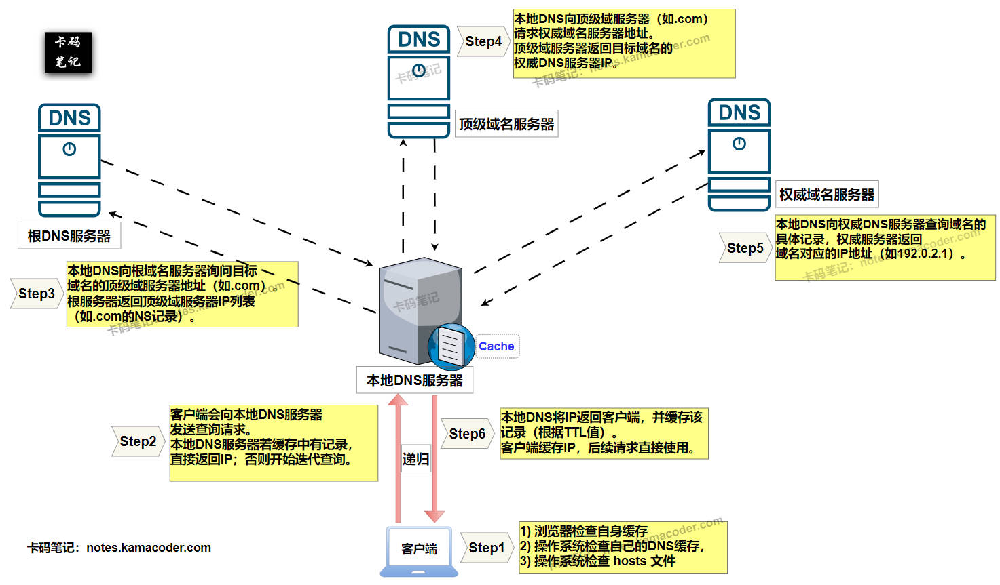

# DNS查询过程是怎样的？

> 来源: https://notes.kamacoder.com/base/dns-query-process.html

# DNS查询过程是怎样的？

## 简要回答

  1. **DNS查询过程**：

客户端首先检查**本地缓存**，若本地缓存没有命中，客户端会向**本地DNS服务器**发起请求，若本地DNS服务器缓存未命中，则依次查询**根域名服务器**、**顶级域名服务器**（如.com）、**权威域名服务器**，最终获取目标域名的IP地址。
   2. **核心机制**：

分层查询 + 缓存优化，通过**递归查询**（客户端到本地DNS）和**迭代查询**（本地DNS到各级服务器）结合实现高效解析。

## 详细回答

  1. **DNS查询过程的分步解析**：

    - **步骤1：客户端本地缓存检查**
 **浏览器**会先检查自身缓存 **(Browser Cache)**，如果浏览器缓存没有命中，**操作系统**会检查自己的DNS缓存，同时，操作系统还会检查 **hosts 文件**（在Linux/macOS中是 `/etc/hosts`，Windows中则是 `C:\Windows\System32\drivers\etc\hosts`）。若命中缓存，直接返回IP，跳过后续查询。
     - **步骤2：向本地DNS服务器发起递归查询**

如果在客户端所有本地缓存和 `hosts` 文件中都未找到记录，客户端会向**本地DNS服务器**发送查询请求。本地DNS服务器若缓存中有记录，直接返回IP；否则开始**迭代查询**。
     - **步骤3：根域名服务器查询**

本地DNS向**根域名服务器**（全球13组根DNS服务器中的一个）询问目标域名的顶级域服务器地址（如.com）。根服务器返回顶级域服务器IP列表（如.com的NS记录）。
     - **步骤4：顶级域名服务器查询**

本地DNS向**顶级域服务器**（如.com）请求权威域名服务器地址。顶级域服务器返回目标域名的权威DNS服务器IP。
     - **步骤5：权威域名服务器查询**

本地DNS向**权威DNS服务器**查询域名的具体记录，权威服务器返回域名对应的IP地址（如`192.0.2.1`）。
     - **步骤6：结果返回与缓存**

本地DNS将IP返回客户端，并缓存该记录（根据TTL值）。客户端缓存IP，后续请求直接使用。

   2. **核心机制与技术细节**：

    - **递归查询 vs 迭代查询**：

① **递归**：客户端到本地DNS（本地DNS负责完成全部查询）。

② **迭代**：本地DNS逐级向根、顶级、权威服务器查询（每次返回下一级地址）。
     - **缓存优化**：

① 各级DNS服务器缓存查询结果，减少全球查询次数。

② TTL（Time to Live）控制缓存有效期（如3600秒）。

## 知识拓展

  1.

**DNS查询流程示意图如下所示：**
 

   2.

**DNS记录类型**：

① **A记录**：IPv4地址

② **AAAA记录**：IPv6地址

③ **CNAME记录**：域名别名（如`www.programmercarl.com/ → programmercarl.com`）。

④ **MX记录**：邮件服务器地址。
