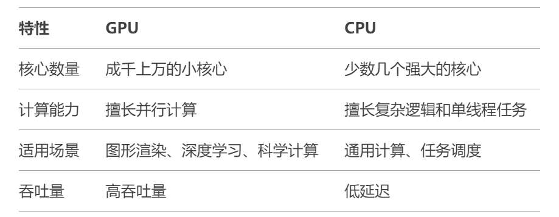
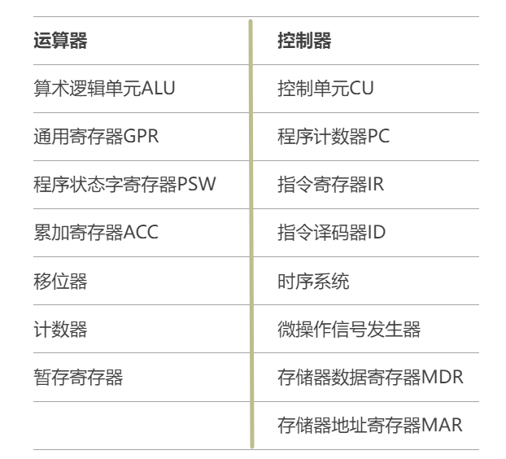

# CPU和GPU的主要区别是什么？

> 来源: https://notes.kamacoder.com/base/cpu-vs-gpu.html

# CPU和GPU的主要区别是什么？

## 【简要回答】

CPU和GPU的概念

  - CPU（**Central Processing Unit**），即**中央处理器**，是计算机的主要设备之一，负责解释计算机指令，协调并控制计算机各组件正确地执行指令序列，并根据指令对数据进行加工。
   - GPU（**Graphics Processing Unit**），即**图形处理器**，是一种专门设计用于处理**图形渲染**和**并行计算**的处理器。GPU具有大量的核心，能够同时执行大量简单的计算任务，适用于处理图形、视频、科学计算和机器学习等需要高并行计算能力的任务。

CPU和GPU的区别

如下表所示：

## 【详细回答】

CPU主要由**运算器**和**控制器**两部分构成，注意——有时候我们也将CPU分为**数据通路**和**控制部件**两部分，这两种分法并不矛盾，前者是从功能模块的角度对CPU进行划分，后者则是从硬件实现的角度对CPU进行划分。

CPU的具体功能包括：(前四个功能由控制器实现，第五个功能由运算器实现）

  1. **指令控制**：

    - 从程序执行的角度，指令控制保证了指令按照程序预先规定好的顺序自动执行。
     - 从指令本身的角度，指令控制还确保了取指令，分析指令和执行指令的顺序执行。

   2. **操作控制**：

    - 产生完成一条指令所需要的操作信号，并把操作信号送到CPU相应的执行部件，使得执行部件按指令规定的操作正确执行。

   3. **时序控制**：

    - 对每个操作信号进行定时，严格控制操作信号的产生时间、持续时间。

   4. **中断控制**：

    - 及时响应内部异常和外部中断请求，如缺页异常和键盘中断。

   5. **数据加工**：

    - 对数据进行算术运算、逻辑运算，或将数据在相关部件之间传送。

GPU主要由**流处理器**和**显存**构成。

GPU的主要功能包括：

  1. **并行计算能力**：

    - GPU拥有成千上万的小核心，能够同时处理大量数据，适合并行计算任务。
     - 例如，在图像处理中，每个像素的计算可以独立进行，GPU可以同时处理多个像素。

   2. **图形渲染**：

    - GPU最初设计用于图形渲染，能够高效处理3D图形、视频游戏、动画等任务。
     - 它负责将3D模型转换为2D图像，并处理光照、阴影、纹理等效果。

   3. **通用计算（GPGPU）**：

    - 现代GPU不仅用于图形处理，还广泛应用于通用计算（General-Purpose computing on Graphics Processing Units，GPGPU）。
     - 例如，深度学习、科学模拟、密码学等领域都利用GPU的并行计算能力加速运算。

   4. **处理大量数据**：

    - GPU专注于高吞吐量，适合处理大量数据，但在处理复杂逻辑和单线程任务时效率不如CPU。

   5. **与CPU进行协作**：

    - CPU和GPU通常协同工作，CPU负责处理复杂的逻辑和任务调度，而GPU负责大规模并行计算。

## 【知识拓展】

  - CPU运算器和控制器的组成结构，如下表所示：

