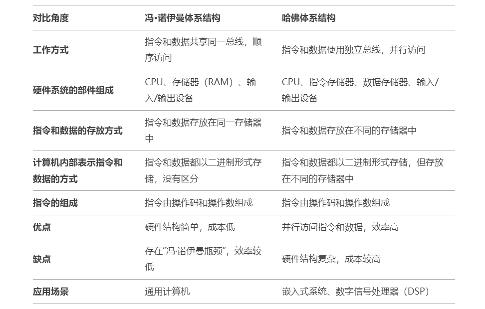
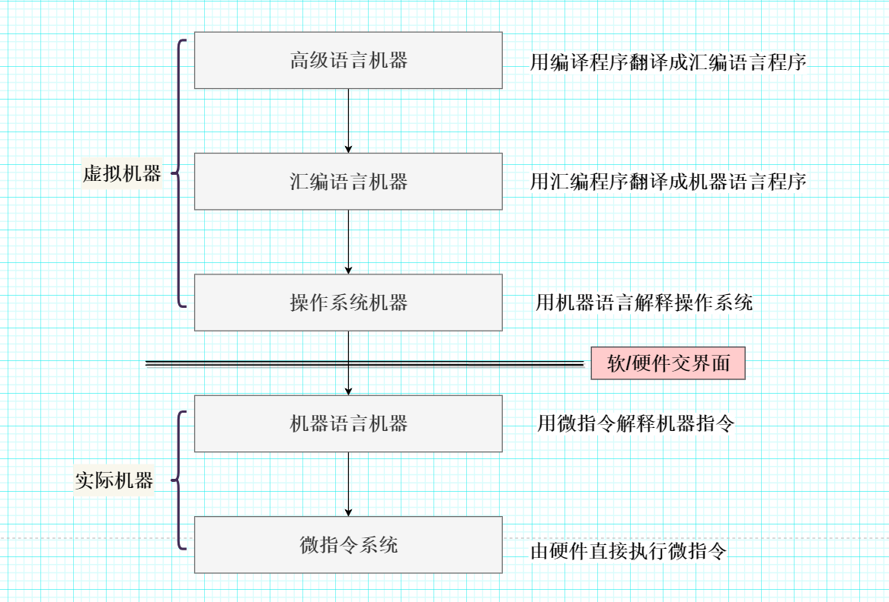

# 冯·诺依曼体系结构与哈佛体系结构的区别是什么？

> 来源: https://notes.kamacoder.com/base/mengnuo.html

# 冯·诺依曼体系结构与哈佛体系结构的区别是什么？

## 简要回答

冯·诺伊曼体系结构 和 哈佛体系结构 的概念

  - 冯·诺伊曼体系结构：由约翰·冯·诺伊曼提出，是一种**将指令和数据存储在同一存储器中**的计算机体系结构。
   - 哈佛体系结构：是一种将**指令和数据存储在不同存储器中**的计算机体系结构。

冯·诺伊曼体系结构 和 哈佛体系结构 的对比

如下表所示：

## 详细回答

**冯·诺伊曼体系结构**：是一种**将指令和数据存储在同一存储器中**的计算机体系结构。早在1945年，数学家冯·诺伊曼在研究EDVAC（Electronic Discrete Variable Automatic Computer）时，便提出了“**存储程序（即程序和数据以同等地位放入存储器中）**”的概念，以此概念为基础的各类计算机统称为冯·诺伊曼计算机。

冯·诺伊曼体系结构的主要特点：

  1. 采用**存储程序**工作方式：将程序和数据以同等地位放入存储器中，CPU根据**指令周期的不同阶段**来区分指令和数据。程序预先存入存储器中，计算机在工作中能从程序首地址取出第一条指令并加以执行，以后就按照该程序的规定顺序执行其他指令，直至程序执行结束。
   2. 计算机硬件系统由**运算器**、**存储器**、**控制器**、**输入设备**和**输出设备**五大部件组成。
   3. 指令和数据都存放在存储器中，按地址访问。
   4. 计算机内部采用**二进制**表示指令和数据，两者形式上没有区别。
   5. 指令由操作码和地址码组成，**操作码**用来表示操作的类型，**地址码**用来表示操作数在存储器中的位置。

**哈佛体系结构（Harvard Architecture）**：是一种计算机体系结构的设计方式，其核心特点是**将指令存储器和数据存储器分开**，并使用独立的总线来访问它们。这种设计使得CPU可以同时访问指令和数据，从而提高了系统的性能和效率。

哈佛体系结构的主要特点：

  1. **指令存储器和数据存储器分离**：哈佛体系结构使用**独立的存储器**来存储指令和数据。指令存储器和数据存储器有各自的总线（地址总线和数据总线），因此CPU可以同时访问指令和数据。
   2. **并行访问**：由于指令和数据存储在不同的物理存储器中，CPU可以在一个时钟周期内同时读取指令和数据，从而提高运行效率。
   3. **硬件复杂度较高**：由于需要两套独立的存储器和总线，哈佛体系结构的硬件设计比冯·诺依曼体系结构更复杂。

## 知识拓展

  - 现代计算机主要是基于冯·诺依曼体系结构设计的。现代计算机由**主机**和**外部设备**两大部分组成：CPU与主存储器合称为主机，I/O设备称为外部设备。
   - 一种经典的计算机系统层次结构图如下：

